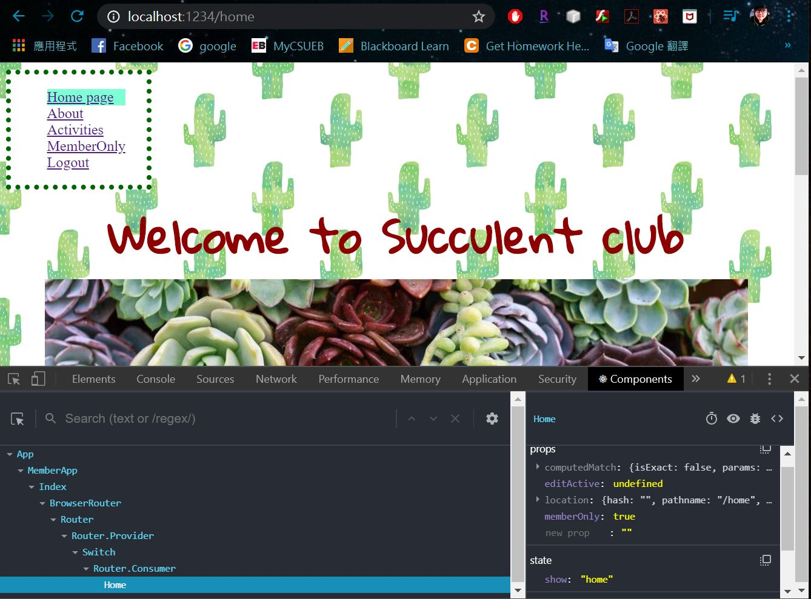

# Homework #8 Solution

**Student Name**:  Tien-Hui Feng
**NetID**: vd8386


## Question 1 

### (a)
### What HTTP Method is used in the request?
    GET, HEAD, POST, PUT, DELETE, CONNECT, OPTIONS, TRACE

### What is the response code and what does it mean?
    HTTP response code indicates what is about to happen.
    1. 200 means OK
    2. 301 means Moved Permanently 
    3. 302 means Found (Moved Temporarily)
    4. 401 means Unauthorized
    5. 403 means Forbidden
    6. 404 means Not Found (the error code)
    7. 410 means Gone
    8. 500 means Internal Server Error
    9. 503 means Service Unavailable 
    
### What version of HTTP is being used?
    HTTP/1.1
### (b) List the request headers and their values here (copy and paste)
    * Controls: Host, Cache-Control, Expect, …
    * Content Negotiation: Accept, Accept-Charset, Accept-Encoding, Accept-Language
    * Authentication Credentials: Authorization, Proxy-Authorization
    * Request Context: From, Referer, User-Agent

### (c) List the response headers and their values here (copy and paste)
    * Control Data: Age, Cache-Control, Expires, Date, Location,…
    * Validator Fields: Etag, Last-Modified
    * Authentication Challenges: WWW-Authenticate, Proxy-Authenticate
    * Response Context: Accept-Ranges, Allow, Server
### (d) What server is BlackBoard based on?
    openresty/1.9.3.1

Are any cookies set? If so what are they.

### (e) URLs
For the following URLs identify the protocol, domain, port, path, query and fragment portions (if any):

https://developer.mozilla.org/en-US/docs/Web/JavaScript/Guide/Grammar_and_Types#Comments

https://www.google.com/search?q=gaia+mission&rlz=1CYPO_enUS751

http://127.0.0.2:8282/static/index.html


## Question 2 

### (a)


### (b)
```javascript 

delRows(i){
    let upRows = activities.rowData.filter(function(act, i){
        if (index === i)
            return false; 
        else
            return true; 
    })
    activities.rowData = JSON.stringify(upRows);
}

```

### (c)

```javascript 
<td><input type='button' value="Delete" onClick={() => this.delRows(i)}/></td>
```

## Question 3

### (a)



### (b)


### (b)
Private network	
Used for local communications within a private network.

### (c)
stackoverflow.com
[ '151.101.193.69', '151.101.65.69', '151.101.129.69', '151.101.1.69' ]

### (d)

## Question 4

### (a) this 
1. point to an instance of an object from within its own class definition
2. keeps track of execution context

### (b)
```javascript
myObj1 = {course: "WebDev", students: 36};
myObj2 = {course: "WebSys", students: 31};
var myFunction = function () {
  console.log(this); function {}
};

myFunction(); // this?  function{}
myObj1.method1 = myFunction;
myObj1.method1(); // this?  function{}
func2 = myObj1.method1.bind(myObj2);
func2(); // this?  function{}

```

### (c)

``` javascript 
function cs351() {
  console.log('This is a msg from CS351');
}
function cs651() {
  console.log('this is a msg from CS651');
}

console.log('Is this the start?');
setTimeout(cs651); // hold msg then printout
console.log('When does this print?');
setTimeout(cs351, 0); // hold msg then printout
console.log('Is this the end?');
```
Is this the start?

When does this print?

Is this the end?

this is a msg from CS651

This is a msg from CS351

### (d)
``` javascript
function winner(name) {
  console.log(`The winner is ${name}`);
}
myP1 = new Promise(function(resolve, reject){
    setTimeout(()=>resolve("P1"), 1000*Math.random());
});
myP2 = new Promise(function(resolve, reject){
    setTimeout(()=>resolve("P2"), 1000*Math.random());
});
myP3 = new Promise(function(resolve, reject){
    setTimeout(()=>resolve("P3"), 1000*Math.random());
});
myPs = [myP1, myP2, myP3];
racingPs = Promise.race(myPs);
```
The code set the random wait time for three players.

Promise.race will return the fastest result that pass back.

```javascript 
setTimeout(function(){
    myPs = Promise.all([myP1,myP2,myP3]);  //to get result from myP1,2,3
    racingPs = myPs.then(function(msg) { Promise.race(msg)}); //call race after myPs result
    winner(racingPs); //show the winner
}, 1000);

```


