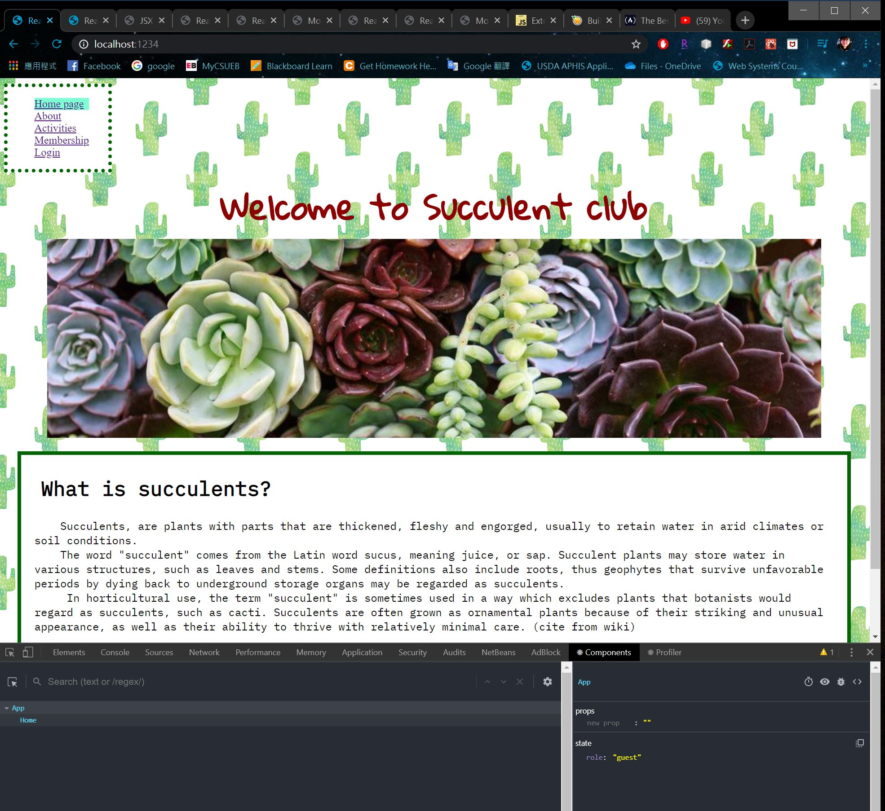
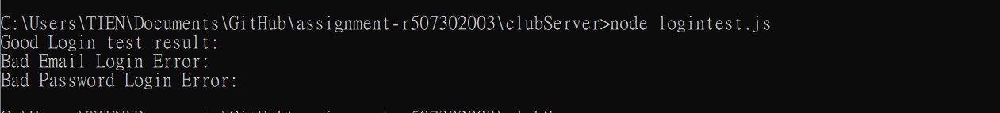

# Homework #9 Solution
**Student Name**:  Tien-Hui Feng
**NetID**: vd8386


## Question 1 Securing User Passwords

### (a) Hash user passwords

hashUsers.js
``` javascript
users.forEach(function(user){
    let passHash = bcrypt.hashSync(user.password, nRounds);
    user.password = passHash;
    hashedUsers.push(user);    
});

[
  {
    "firstName": "Melia",
    "lastName": "Barker",
    "email": "tirrivees1820@outlook.com",
    "password": "$2a$10$.wAqcJN1vIhoCw4vVoP6fuvhuWD8DP61Bup2CuXAb1.0KouLdqNzq",
    "role": "admin"
  },
  {
    "firstName": "Demetrice",
    "lastName": "Parker",
    "email": "chihuahua1899@gmail.com",
    "password": "$2a$10$q8SqNk6jYX6/omJnOVsbX.QnwXiz6wmOMiJKmlqFHrxxnzIX7lgWG",
    "role": "member"
  },
  {
    "firstName": "Ligia",
    "lastName": "Hudson",
    "email": "umbrate1989@yahoo.com",
    "password": "$2a$10$pjWFUoE.uMdL5Az1pFb1IuVs26ddfx0N2oPkpoEg0X9kUbDzifDVK",
    "role": "member"
```

### (b) bcrypt work



## Question 2 Basic Login Interface and Test

### (a) Login interface and handler
```javascript 
app.post('/login', express.json(), function(req, res){
    let email = req.body.email; 
    let password = req.body.password; 
    let auser = users.find(function (usr){
        return usr.email === email
    });
    if(!auser){
        res.status(401).json({error: true, message: "User/Email error" });
        return;
    }else{
        bcrypt.compareSync(password, auser.password, function (err, result){
        if(result == true){
            let newUserInfo = Object.assign(oldInfo, auser);
            delete newUserInfo.password; 
            req.session.user = newUserInfo; 
            res.json(newUserInfo);
        } else{
            res.status(401).json({"error": true, "message": "User/password error" });
        }}) 
        }
    }
    )
});

```

### (b) Test Login Interface

```javascript 
const rp = require("request-promise-native");

let initialGet={
    uri: "http://127.8.88.5:8386/activities",
    json: true,
    method: 'GET'
}
let goodLogin = {
    uri: "http://127.8.88.5:8386/login",
    json: true,
    method: "POST",
    body: { firstName: "Melia",
            lastName: "Barker",
            email: "tirrivees1820@outlook.com",
            password: "$2a$13$9FSQlmbk7YsK/UmzTIL64enuRkKmrHKRWzPk8MmXIa3WuaAp5sfJe",
            "role": "admin"} 
};

let emailErr = {
    uri: "http://127.8.88.5:8386/login",
    json: true,
    method: "POST",
    body: { firstName: "Melia",
            lastName: "Barker",
            email: "worng0@outlook.com",
            password: "$2a$13$9FSQlmbk7YsK/UmzTIL64enuRkKmrHKRWzPk8MmXIa3WuaAp5sfJe",
            "role": "admin"} 
};    
    
let pswdErr = {
    uri: "http://127.8.88.5:8386/login",
    json: true,
    method: "POST",
    body: { firstName: "Melia",
            lastName: "Barker",
            email: "tirrivees1820@outlook.com",
            password: "$2a$13$9FWzPk8MmXIa3WuaAp5sfJe",
            "role": "admin"} 
};    

function printUser(data) {
    console.log(`{ "firstName": ${data.firstname}, "lastName": ${data.lastName}, "email": ${data.email}, "password": ${data.password} }  `);
}    
    
rp(initialGet).then(function(data) {
    return rp(goodLogin);
})
.then(function(data) {
    console.log("Good Login test result: ");
    printUser(data);
    return rp(emailErr);
})
.catch(function(err) {
    console.log("Bad Email Login Error: ")
    printUser(data);
    return rp(pswdErr);
})
.then(function(data) {
    printUser(data);
    return rp(pswdErr);
})
.catch(function(err) {
    console.log("Bad Password Login Error: ")
})
```

## Question 3 Sessions/Login

### (a) Add express-session to your clubServer
```javascript
const session = require('express-session');

const cookieName = "vd8386"; // Session ID cookie name, use this to delete cookies too.
app.use(session({
	secret: TienHuiFeng vd8386,
	resave: false,
	saveUninitialized: true,
	cookie: { secure: true },
    name: cookieName
}));


function checkCustomerMiddleware(req, res, next) {
	if (req.session.user.role === "guest") {
		res.status(401).json({error: "Not permitted"});;
	} else {
		next();
	}
};

```

### (b) Test Session Cookies


### (c) Update login POST route
```javascript 
app.post('/login', express.json(), function(req, res){
    let email = req.body.email; 
    let password = req.body.password; 
    let auser = users.find(function (usr){
        return usr.email === email
    });
    if(!auser){
        res.status(401).send({error: true, message: "User/Email error" });
        return;
    }else{
        bcrypt.compareSync(password, auser.password, function (err, result){
        if(result == true){
            let newUserInfo = Object.assign(oldInfo, auser);
            delete newUserInfo.password; 
            req.session.user = newUserInfo; 
            res.json(newUserInfo);
        } else{
            res.status(401).send({"error": true, "message": "User/password error" });
        }}) 
        }
    });

```

### (d) Create a logout GET path 
```javascript 
app.get('/logout', function (req, res) {
	let options = req.session.cookie;
	req.session.destroy(function (err) {
		if (err) {
			console.log(err);
		}
		res.clearCookie(cookieName, options); // the cookie name and options
		res.json({message: "Goodbye"});
	})
});

``` 

### (e) Testing login, logout, and cookies


## Question 4 Protect Add Activity Interface

### (a) Create and Insert Protection Middleware 
Create middleware that checks for the “admin” role and if it doesn’t find it returns a “Forbidden” code and JSON error message. Add that middleware to the POST handler for adding tours. Show the code for that middleware here.


### (b) Testing Protected Interface


## Question 5. Protected Get Users Interface

### (a) Create /users Interface
```javascript 
function checkAdminMiddleware(req, res, next) {
	if (req.session.user.role !== "admin") {
		res.status(401).json({error: "Not permitted"});;
	} else {
		next();
	}
};


```


### (b) Test Protected /users Interface

