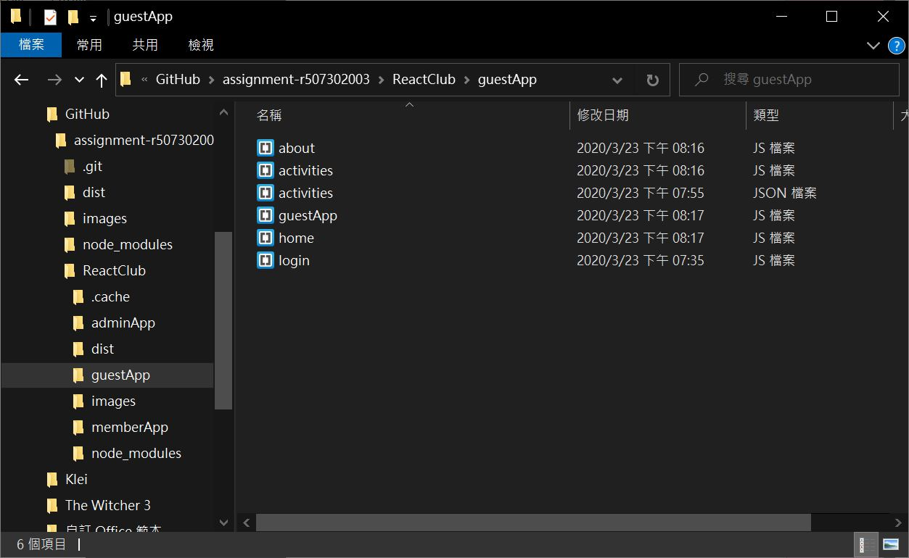

# Homework #7 Solution

**Student Name**:  Tien-Hui Feng
**NetID**: vd8386


## Question 1 

### (a) 

### (b)


### (c)

### (d)
```javascript 
addRows(){
    var newRow = JSON.parse(activities); newRow[rowData].push({"name":"1","location":this.state.location,"time":this.state.time,"dates":this.state.dates });
    activities = JSON.stringify(newRow);
}
```
### (e)
```javascript 
<form className="form">
    <label> Name: </label>
        <input type="text" id='name'   onChange={(e) => this.setState({ name: e.target.value })} />

    <label>Dates:</label>
        <input type="text"   onChange={(e) => this.setState({ dates: e.target.value })} />

    <label>Time:</label>
        <input type="text"   onChange={(e) => this.setState({ time: e.target.value })} />

    <label>Location:</label>
        <input type="text"   onChange={(e) => this.setState({ location: e.target.value })} />
    <input type="button" value="Add" onClick={()=>this.addRows} />
```

### (f)
```javascript 
onChange={(e) => this.setState({ dates: e.target.value })
```

## Question 2 

### (a)


### (b)
```javascript 

delRows(i){
    let upRows = activities.rowData.filter(function(act, i){
        if (index === i)
            return false; 
        else
            return true; 
    })
    activities.rowData = JSON.stringify(upRows);
}

```

### (c)

```javascript 
<td><input type='button' value="Delete" onClick={() => this.delRows(i)}/></td>
```

## Question 3

### (a)


### (b)


### (b)
Private network	
Used for local communications within a private network.

### (c)
stackoverflow.com
[ '151.101.193.69', '151.101.65.69', '151.101.129.69', '151.101.1.69' ]

### (d)

## Question 4

### (a) this 
1. point to an instance of an object from within its own class definition
2. keeps track of execution context

### (b)
```javascript
myObj1 = {course: "WebDev", students: 36};
myObj2 = {course: "WebSys", students: 31};
var myFunction = function () {
  console.log(this); function {}
};

myFunction(); // this?  function{}
myObj1.method1 = myFunction;
myObj1.method1(); // this?  function{}
func2 = myObj1.method1.bind(myObj2);
func2(); // this?  function{}

```

### (c)

``` javascript 
function cs351() {
  console.log('This is a msg from CS351');
}
function cs651() {
  console.log('this is a msg from CS651');
}

console.log('Is this the start?');
setTimeout(cs651); // hold msg then printout
console.log('When does this print?');
setTimeout(cs351, 0); // hold msg then printout
console.log('Is this the end?');
```
Is this the start?

When does this print?

Is this the end?

this is a msg from CS651

This is a msg from CS351

### (d)
``` javascript
function winner(name) {
  console.log(`The winner is ${name}`);
}
myP1 = new Promise(function(resolve, reject){
    setTimeout(()=>resolve("P1"), 1000*Math.random());
});
myP2 = new Promise(function(resolve, reject){
    setTimeout(()=>resolve("P2"), 1000*Math.random());
});
myP3 = new Promise(function(resolve, reject){
    setTimeout(()=>resolve("P3"), 1000*Math.random());
});
myPs = [myP1, myP2, myP3];
racingPs = Promise.race(myPs);
```
The code set the random wait time for three players.

Promise.race will return the fastest result that pass back.

```javascript 
setTimeout(function(){
    myPs = Promise.all([myP1,myP2,myP3]);  //to get result from myP1,2,3
    racingPs = myPs.then(function(msg) { Promise.race(msg)}); //call race after myPs result
    winner(racingPs); //show the winner
}, 1000);

```


