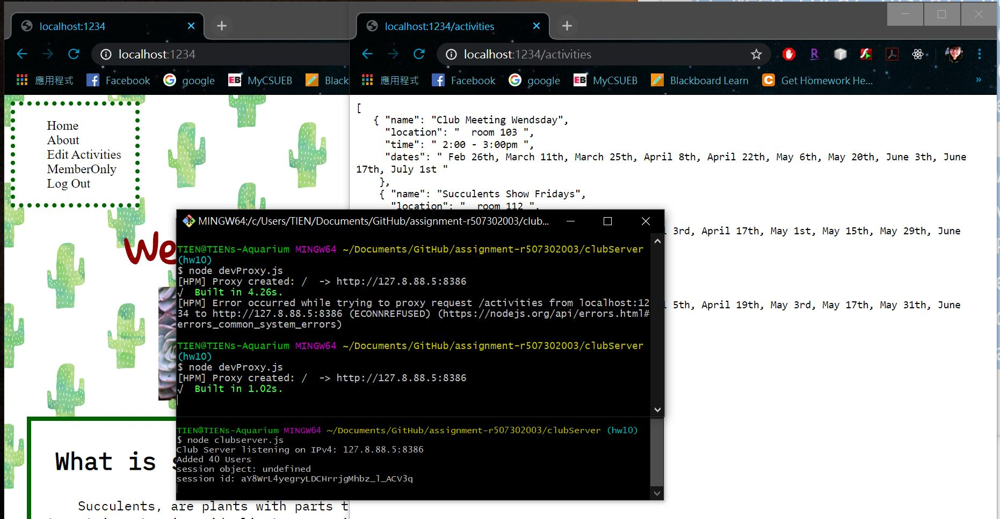

# Homework #10 Solution
**Student Name**:  Tien-Hui Feng
**NetID**: vd8386


## Question 1 REST APIs

### (a) Check existing interfaces
// path, method, return codes on sucess and failure

1. /activities
* GET
* sucess - 200
* Not found - 404


2. /activities
* POST
* sucess - 200
* Not found - 404

3. /activities/:index
* DELETE
* sucess - 200
* No Content - 204

4. /users
* GET
* sucess -200
* unauthorized - 401


### (b) REST like interfaces?

### (c) Update Activity Interface

/activities/:index
* POST
* 200
* 401

### (d) Add and Delete Club Member

/login/modifyMember
* POST
* 200
* 401

### (e) Change Member Password
/login/changePassword
* POST
* 200
* 401

## Question 2 Activities DataBase

### (a) Create Initial Activity Database

```javascript
const DataStore = require('nedb');
db = new DataStore({filename: __dirname + '/actDB', autoload: true});

const activities = require('./activities.json');
// We let NeDB create _id property for us.

db.insert(activities, function(err, newDocs) {
    if(err) {
        console.log("Something went wrong when writing");
        console.log(err);
    } else {
        console.log("Added " + newDocs.length + " activities");
    }
});

```

### (b) Integrate Database Into Server
Use following code to get data from actDB
```javascript 
actdb = new DataStore({filename: __dirname + '/actDB', autoload: true});
actdb.find({}, function(err, docs) {
    if (err) {
        console.log("something is wrong");
    } else {
        //print out activities
        console.log("We found " + docs.length + " documents");
        console.log(docs);
    }
});
```
The APIs need to be update: 
* /activities, POST: 
add following code to insert new activity into actDB
``` javascript
    actdb.insert(activity); 
```
* /activities/:index, delete: 
```javascript 
app.delete('/activities/:index',checkAdminMiddleware, function (req, res){
    let index = req.params.index; 
    actdb.remove({_id: index },function (err, index) 
    {
        console.log("removed " + index);
        });
});    
```

### (c) Test Server with Activities Database


## Question 3 Proxies

### (a) Alternate Development Scenario

### (b) Development Proxy
1. Where should the development proxy (devProxy) code be located? E.g., with the React client code or with the server code?
 Neither. Create a new file in bewteen client and server 

2. What paths are you going to forward to the server?
    '/activities', '/login', '/logout', '/users'
    
3. On what IP address and port are you going to run your club server?
    http://127.8.88.5:8386

4. On what IP address and port are you going to run your devProxy?
    http://127.8.88.5:8386
    
5. At which URL will you point your browser?
    localhost:1234
    
6. How many command terminals do you need and what will be running in each?
    Just key in localhost:1234 within path
    
7. What additional NPM packages do you need to install and where?
    * [http-proxy-middleware](https://www.npmjs.com/package/http-proxy-middleware)
    * [parcel-bundler](https://parceljs.org/api.html#middleware)

8. How can you test that the proxy is forwarding your requests?
    Check if server running, and sync.  

### (c) Configure, run, and debug the dev. proxy



## Question 4 Fetch for Login

### (a) Member and Admin Login 


### (b) Member and Admin Logout


## Question 5. Fetch for Activities

### (a) Members Activities Component


### (b) Fetch Activities in the Component

