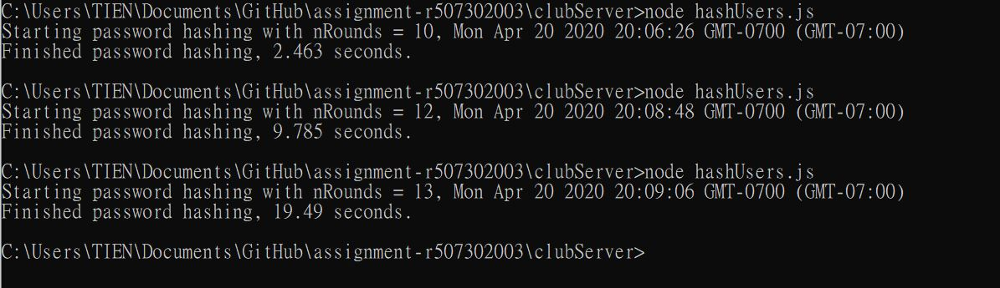

# Homework #6 Solution

**Student Name**:  Tien-Hui Feng

**NetID**: vd8386


## Question 1 

### (a) 
### (b)


### (c)


### (d)
```javascript
class App extends React.Component {
    constructor(props) {
        super(props);
        this.state = {
        role: "guest" 
        };
    }
    
    // Renders component based on current state and props
    render() {
        if(this.state.role == "admin"){
            return (
                <div className="App">
                    <Admin />
                </div> 
            ); 
        }
        else if(this.state.role == "member"){
            return (
                <div className="App">
                    <Member />
                </div> 
            ); 
        }
        else{
            return(
                <div className="App">
                    <Guest />
                </div>
            );
        }
                }
            }
ReactDOM.render(<App />, document.getElementById("root"));


```
## Question 2 

### (b)


#### index.js 
```javascript
      return (
    <Router>
        <Switch>
            <Route exact path="/" component={Home} />
            <Route path="/about" component={About} />
          <Home />
        </Switch>
    </Router> );
        }
}
```

#### home.js
```javascript
notImplemented(e){
    let bodyText = document.getElementById("bodyText"); 
    bodyText.innerHTML = `<h1> Not Implemented Yet </h1>`; 
    this.setState({
    show: e
    }); 
}
<ul>
    <li className="active"><a href="/home">Home page</a></li>
    <li><a href="/about">About</a></li>
    <li><a href="#" onClick={() => this.notImplemented()}>Activities</a></li>
    <li><a href="#" onClick={() => this.notImplemented()}>Membership</a></li>
    <li><a href="#" onClick={() => this.notImplemented()}>Login</a></li>
</ul>
```

#### about.js 
```javascript 
notImplemented(e){
    let bodyText = document.getElementById("bodyText"); 
    bodyText.innerHTML = `<h1> Not Implemented Yet </h1>`; 
    this.setState({
    show: e
    });  }
<ul>
    <li><a href="/home">Home page</a></li>
    <li className="active"><a href="/about">About</a></li>
    <li><a href="#" onClick={() => this.notImplemented('activities')}>Activities</a></li>
    <li><a href="#" onClick={() => this.notImplemented('membership')}>Membership</a></li>
    <li><a href="#" onClick={() => this.notImplemented('login')}>Login</a></li>
</ul>
```
## Question 3

### (a)


### (b)


## Question 4


## Question 5


